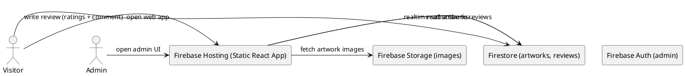

# SPEC-1-Art Model Review and Rating Dashboard

## Background

An exhibition will display physical 3D models that depict how specific places and structures would look during the time of the Prophet Muhammad (peace be upon him). Volunteers will present short histories and explanations in rooms/stalls containing these models. The goal is to collect public, anonymous feedback from visitors for each model/room/stall and to show aggregated ratings on a public dashboard in near real-time.

> **Important note on content sensitivity:** The exhibition topic is religious and culturally sensitive. The architecture below focuses only on the review & dashboard platform. Avoid generating or displaying images that depict the Prophet. Ensure all content (artwork photos, descriptions) conforms to local cultural and religious considerations and that volunteers and admins are trained to moderate content accordingly.

## Requirements

### Must Have (MUST)

- Public, mobile-friendly web application (React) hosted free (Firebase Hosting).
- Admin-only interface to upload/manage artworks (images and metadata) protected by Firebase Authentication.
- Public review submission UI (no sign-in required) that records up to 5 rating categories per artwork. Ratings are integer 1–5 stars.
- Minimal optional text comment per submission.
- Firestore stores reviews; client apps subscribe to changes and update dashboards in real-time (or near-real-time).
- Dashboard aggregates and shows average scores per category per artwork, total reviews, and simple time-series (last 24 hours).
- Abuse mitigation: rate-limiting, Firestore security rules, and optional CAPTCHA integration if needed.

### Should Have (SHOULD)

- Anonymous submissions but retain minimal metadata (timestamp, optional venue region) for analytics.
- Admin moderation: flagging and removal of reviews.
- Responsive gallery view showing artwork image, stall/room id, description, and quick-action to submit rating.

### Could Have (COULD)

- Filters and sorting (by rating, recent, stall).
- Lightweight offline support (client caches pending submissions while network is down).
- Export reviews as CSV for post-event analysis.

### Won't Have (WON'T) — MVP exclusions

- No user accounts for public reviewers.
- No paid hosting or paid third-party backends.
- No advanced identity fraud detection beyond basic rate limits and moderation.


## Method — High-Level & Low-Level Design

## Chosen Stack

- Frontend: **React** (Vite recommended) + Firebase JavaScript SDK (v9 modular).
- Hosting: **Firebase Hosting (free tier)**.
- Datastore & Realtime: **Firestore**.
- Authentication: **Firebase Authentication** for admin (email+password or Google Sign-in).
- Optional: reCAPTCHA v3 or hCaptcha for abuse mitigation.

## High-Level Architecture (HLD)

- Static React app served by Firebase Hosting.
- React uses Firebase client SDK to read/write Firestore directly.
- Admin UI uses Firebase Auth to show additional controls (upload artwork metadata to Firestore, upload images to Firebase Storage).
- Public users view gallery, select artwork, and submit a review — writes a new document to Firestore under `/artworks/{artworkId}/reviews/{reviewId}`.
- Dashboard subscribes to aggregated data either by client-side aggregation (recommended for MVP) or via pre-aggregated documents.

### HLD Diagram (PlantUML)




```yaml
/artworks/{artworkId}
  - title: string
  - artist: string
  - stallId: string
  - imageUrl: string
  - description: string
  - createdAt: timestamp
  - createdBy: adminUid
  - categories: array[string] (max 5, e.g., ["Design","Explanation","Craftsmanship","Context","Overall"])
  - aggregate: map {
      totalReviews: number,
      counts: map { catName: { totalScore: number, avg: number, count: number } }
    }

 /artworks/{artworkId}/reviews/{reviewId}
  - ratings: map { categoryName: number }  (1-5)
  - comment: string (optional)
  - anon: boolean
  - createdAt: timestamp
  - ipHash: string (optional)
```


---

## Low-Level Design & Implementation

## Firestore Writes (review submission)

1. Visitor fills ratings (map of up to 5 numeric fields) and optional comment.
2. Client validates input (1–5 per field).
3. Optionally run reCAPTCHA token verification on client.
4. Batched write: create review document under `/artworks/{id}/reviews/{uuid}` and optionally update artwork aggregate using `FieldValue.increment()`.

### Example batched write (pseudo, modular SDK)

```js
import { getFirestore, collection, doc, writeBatch, serverTimestamp, increment } from 'firebase/firestore'
const db = getFirestore()

async function submitReview(artworkId, ratings, comment) {
  const reviewRef = doc(collection(db, 'artworks', artworkId, 'reviews'))
  const artRef = doc(db, 'artworks', artworkId)
  const batch = writeBatch(db)
  batch.set(reviewRef, { ratings, comment, createdAt: serverTimestamp(), anon: true })

  // Update aggregates per category
  Object.entries(ratings).forEach(([cat, score]) => {
    batch.update(artRef, {
      [`aggregate.counts.${cat}.totalScore`]: increment(score),
      [`aggregate.counts.${cat}.count`]: increment(1),
      [`aggregate.totalReviews`]: increment(1)
    })
  })

  await batch.commit()
}


import { useEffect, useState } from 'react'
import { collection, query, onSnapshot, orderBy } from 'firebase/firestore'
import { db } from './lib/firebase'

export function useReviews(artworkId) {
  const [reviews, setReviews] = useState([])

  useEffect(() => {
    if (!artworkId) return
    const q = query(collection(db, 'artworks', artworkId, 'reviews'), orderBy('createdAt', 'desc'))
    const unsub = onSnapshot(q, (snapshot) => {
      const arr = snapshot.docs.map(d => ({ id: d.id, ...d.data() }))
      setReviews(arr)
    })
    return () => unsub()
  }, [artworkId])

  return reviews
}


function computeAggregates(reviews, categories) {
  const agg = { totalReviews: 0, counts: {} }
  categories.forEach(cat => agg.counts[cat] = { totalScore: 0, count: 0, avg: 0 })

  reviews.forEach(r => {
    agg.totalReviews += 1
    for (const [cat, score] of Object.entries(r.ratings || {})) {
      if (!agg.counts[cat]) continue
      agg.counts[cat].totalScore += score
      agg.counts[cat].count += 1
      agg.counts[cat].avg = agg.counts[cat].totalScore / agg.counts[cat].count
    }
  })
  return agg
}
```

```bash
/art-review-app
  /public
  /src
    /components
      ArtworkCard.jsx
      Gallery.jsx
      ReviewForm.jsx
      Dashboard.jsx
      AdminPanel.jsx
      Login.jsx
    /lib
      firebase.js
      firestoreHelpers.js
    /styles
    main.jsx
    App.jsx
  firebase.json
  package.json
  README.md
```

```js
import { initializeApp } from 'firebase/app'
import { getAuth } from 'firebase/auth'
import { getFirestore } from 'firebase/firestore'
import { getStorage } from 'firebase/storage'

const firebaseConfig = {
  apiKey: 'YOUR_API_KEY',
  authDomain: 'YOUR_PROJECT.firebaseapp.com',
  projectId: 'YOUR_PROJECT_ID',
  storageBucket: 'YOUR_PROJECT_ID.appspot.com',
  messagingSenderId: '...'
}

const app = initializeApp(firebaseConfig)
export const auth = getAuth(app)
export const db = getFirestore(app)
export const storage = getStorage(app)
```


---

## Firestore Rules & Deployment

## Full Firestore Rules (copy into Firebase Console)

```js
rules_version = '2';
service cloud.firestore {
  match /databases/{database}/documents {

    match /artworks/{artworkId} {
      allow read: if true;
      allow create, update, delete: if request.auth != null && request.auth.token.admin == true;

      match /reviews/{reviewId} {
        allow read: if true;

        allow create: if request.time < timestamp.date(2100, 1, 1)
          && request.resource.data.keys().hasAll(['ratings','createdAt','anon'])
          && request.resource.data.ratings is map
          && request.resource.data.ratings.size() <= 5
          && request.resource.data.ratings.values().all(score => score is int && score >= 1 && score <= 5)
          && (request.resource.data.comment == null || request.resource.data.comment.size() <= 500)
          && request.resource.data.createdAt == request.time;

        allow delete: if request.auth != null && request.auth.token.admin == true;
      }
    }
  }
}
```

### Deployment Steps (concise)

1. **Create a Firebase project**

  Open the Firebase Console: [https://console.firebase.google.com](https://console.firebase.google.com)

2. **Enable core services**

  Enable Firestore (native mode), Firebase Authentication (Email/Password), and Firebase Storage in the Firebase Console.

3. **Publish Firestore rules**

  In Firebase Console → Firestore → Rules: paste the rules from this document and publish.

4. **Scaffold the local React + Vite app**

```bash
npm init @vitejs/app art-review-app --template react
cd art-review-app
npm install
```

5. **Add Firebase configuration**

  Add your Firebase config to `src/lib/firebase.js` (see the `firebaseConfig` example earlier).

6. **Implement application components**

  Build Gallery, ReviewForm, Dashboard, AdminPanel, and any helper modules (e.g., `firestoreHelpers.js`).

7. **Test locally**

```bash
npm run dev
```

8. **(Optional) Use Firebase Emulator Suite for local testing**

```bash
firebase init emulators
firebase emulators:start
```

9. **Deploy to Firebase Hosting**

```bash
npm run build
firebase init hosting   # select your build output directory (e.g., dist)
firebase deploy --only hosting
```

10. **Open the deployed site**

  Open the hosting URL shown in the Firebase Console and verify the app and dashboard work.

### Optional: reCAPTCHA

If you detect abuse, integrate reCAPTCHA v3 into the ReviewForm. Reliable verification requires a server-side secret check; for a frontend-only app you can use the client token as a weak signal combined with moderation and rate-limiting.


---

## Milestones, Testing Plan, Monitoring, and Appendix

## Milestones

1. **MVP setup (1-2 days)**
   - Firebase project and Firestore rules.
   - React app skeleton with gallery and review submission wired to Firestore.
   - Deploy to Firebase Hosting.

2. **Dashboard & Aggregation (1 day)**
   - Real-time dashboard implemented and tested.
   - Admin auth and artwork creation UI.

3. **Moderation and Abuse Mitigation (0.5-1 day)**
   - Admin delete/flagging, client-side throttling, optional CAPTCHA.

4. **Polish & Mobility (0.5-1 day)**
   - Responsive UI, accessibility improvements, CSV export.

## Testing Plan

- **Functional tests**
  - Submit reviews across multiple artworks; verify aggregates update correctly.
  - Admin creates and deletes artwork; image upload and URL stored properly.

- **Security tests**
  - Attempt malformed writes and verify Firestore rejects them.
  - Ensure admin-only endpoints are protected by Firebase Auth and admin claim.

- **Load test (manual)**
  - Simulate ~100 concurrent writes/minute using a short script or small team; monitor Firestore quotas in Firebase Console.
  - If nearing free-tier limits, switch to client-side aggregation only and reduce read frequency.

- **Usability tests**
  - Quick user sessions with volunteers to ensure the rating flow is clear and fast.

## Monitoring & Cost Control

- Monitor Firestore read/write/ storage and bandwidth in Firebase Console.
- Compress images before upload; restrict max image file size on admin UI.
- Use client-side aggregation & limited listener windows (e.g., only last N reviews) to reduce reads.

## Edge Cases & Risks

- **Bulk voting / abuse:** Mitigation: CAPTCHA, client throttles, moderation, and ipHash logging (hashed) for manual detection.
- **Cultural sensitivity:** Enforce moderation policy and train admins to review content.
- **Firestore limits:** For very large datasets, pre-aggregate or move heavy processing to a server (out of scope for free-only MVP).

## Appendix

- Suggested categories (max 5): `Design`, `Explanation`, `Craftsmanship`, `Context`, `Overall`.
- Suggested data retention: keep all reviews for analytics; optionally allow admin to prune older reviews after event.
- Simple volunteer tablet setup: full-screen browser, pre-open web app, local Wi-Fi, device auto-lock disabled for session.

---

If you want, next I can:

- Generate the **full React code scaffold** (each file as copy-paste blocks) to implement the MVP, OR
- Produce a **volunteer on-site checklist** and printable quick-guide for tablets, OR
- Produce some **Firebase console step-by-step screenshots** (requires you to allow uploading images or describing your console) — pick one.


